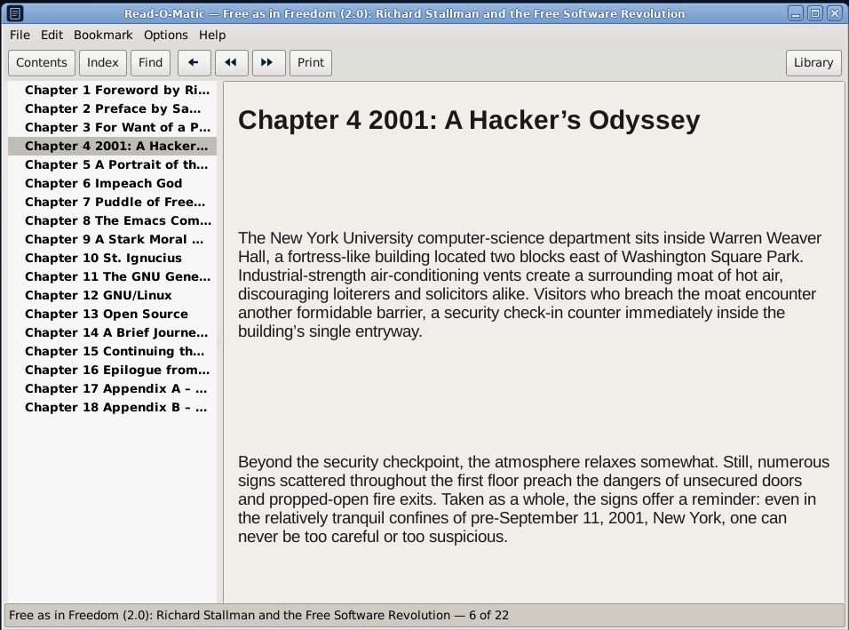
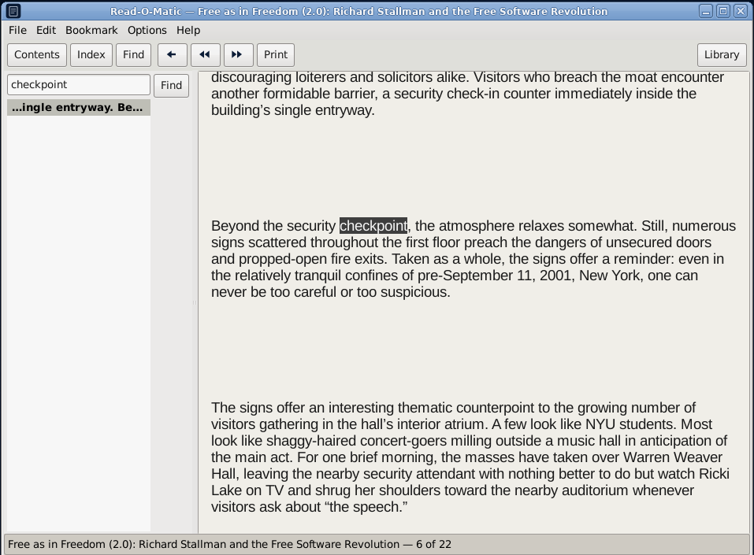
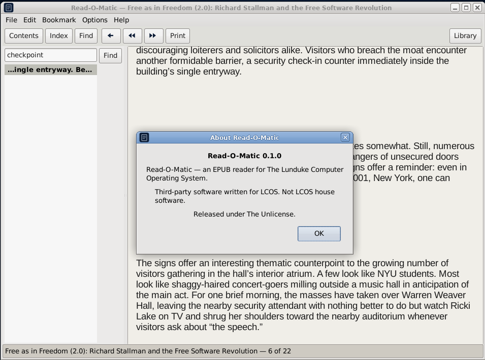
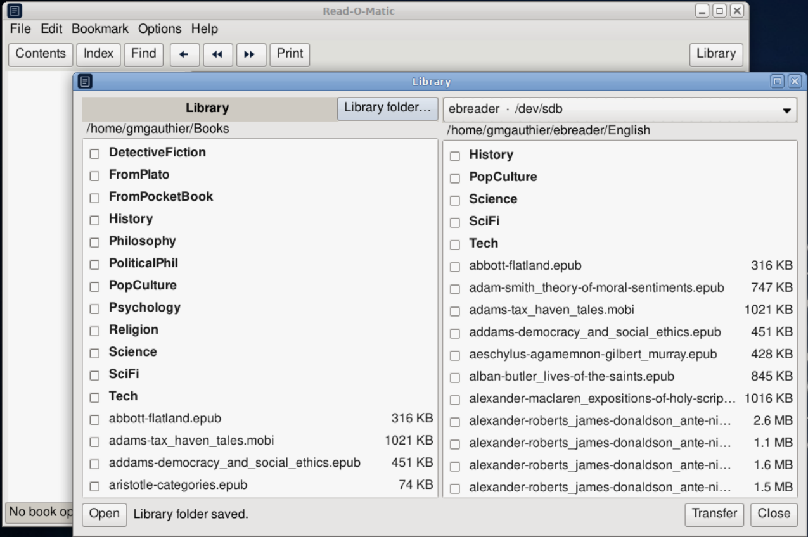
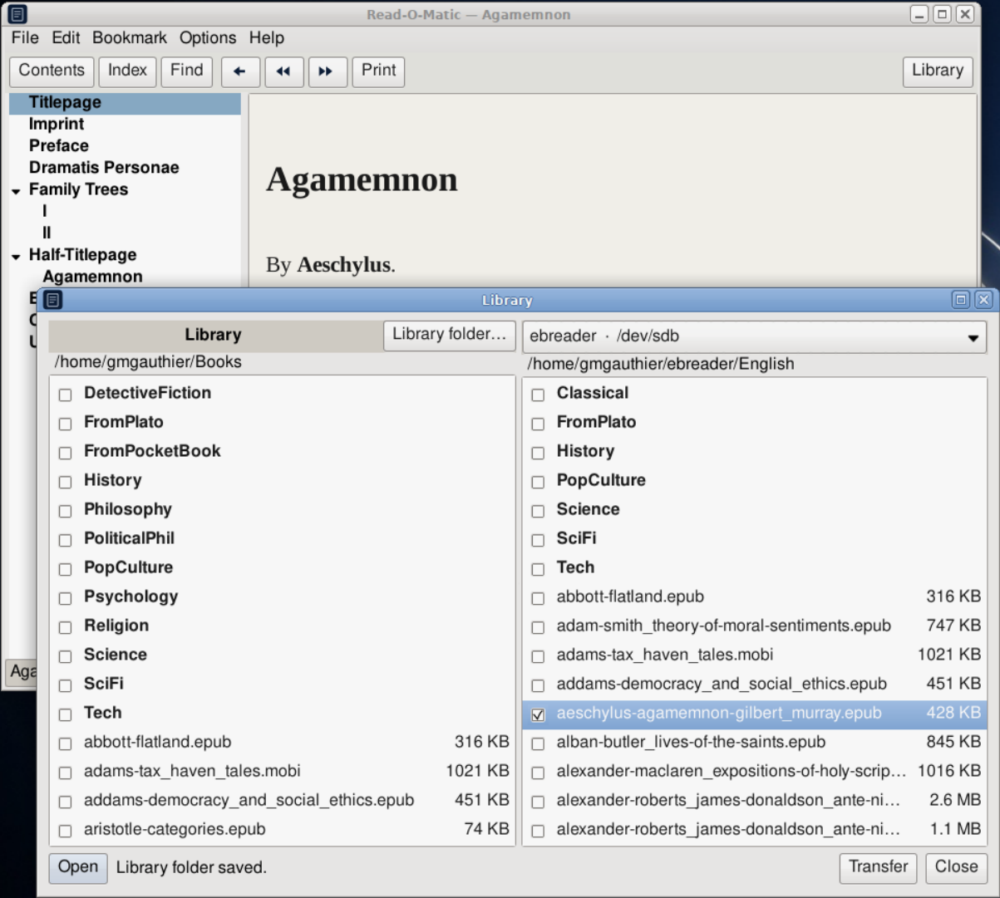

# Read-O-Matic

**Vended by Grok Build**



An **EPUB reader** for The Lunduke Computer Operating System (LCOS). The window is WinHelp 4 / OS/2 `VIEW.EXE`, not a web browser.

Binary: `readomatic`. Unlicense.

LCOS itself: [https://github.com/BryanLunduke/LCOS](https://github.com/BryanLunduke/LCOS)









## Status

**M6 in tree**, plus **Library** (0.3.0): dual-pane copy to an attached reader, last-page-read sidecar, Open in the reader. `.deb` / tarball / AppImage via `./scripts/release.sh`. See [INSTALL.md](INSTALL.md). Samples in `data/samples/` (git-only).

| Doc | What |
|---|---|
| [DEVELOPMENT.md](DEVELOPMENT.md) | Locked decisions, architecture, milestones M0–M6, branching, semver, lint |

Thunar Open with: EPUB (payload) and MOBI (listed; not readable yet). `Exec=readomatic %F`. Single-instance via flock + Unix socket (no D-Bus).

## Build

```
sudo apt install build-essential meson ninja-build pkg-config g++ libgtkmm-3.0-dev clang-format cppcheck
meson setup build
meson compile -C build
./build/readomatic
```

PR lint gate: `./scripts/lint.sh` (CI runs this; no `--fix`). Format `src/` locally with `./scripts/lint.sh --fix`.

## Install

Preferred: `./scripts/release.sh deb` then `sudo apt install ./dist/readomatic_0.3.0-1_amd64.deb`. Details in [INSTALL.md](INSTALL.md).

## License

[The Unlicense](https://unlicense.org). See [UNLICENSE](UNLICENSE).
