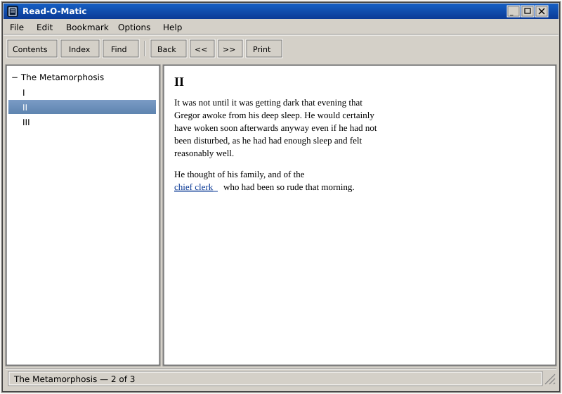

# Read-O-Matic



An **EPUB reader** for The Lunduke Computer Operating System (LCOS). The window is WinHelp 4 / OS/2 `VIEW.EXE`, not a web browser.

Binary: `readomatic`. Unlicense.

LCOS itself: [https://github.com/BryanLunduke/LCOS](https://github.com/BryanLunduke/LCOS)

## Status

**M0 stub.** gtkmm-3 window: File / Bookmark / Options menus, Contents · Index · Find toolbar, left notebook, topic pane (`Gtk::TextView`), status bar. File → Open… picks an `.epub` but does not parse it yet.

Next: **M1 — Open EPUB** (see [DEVELOPMENT.md](DEVELOPMENT.md)). Sample books live in `data/samples/` (git-only).

| Doc | What |
|---|---|
| [DEVELOPMENT.md](DEVELOPMENT.md) | Locked decisions, architecture, milestones M0–M6 |

## Build

```
sudo apt install build-essential meson ninja-build pkg-config g++ libgtkmm-3.0-dev
meson setup build
meson compile -C build
./build/readomatic
```

## License

[The Unlicense](https://unlicense.org). See [UNLICENSE](UNLICENSE).
